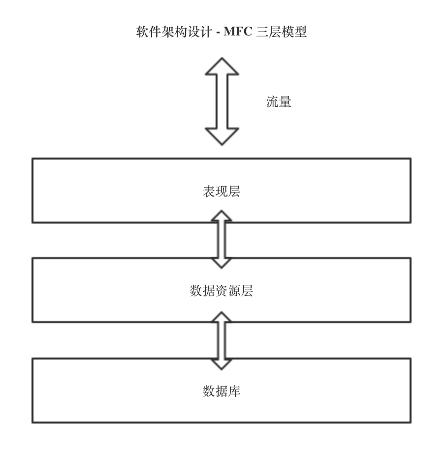
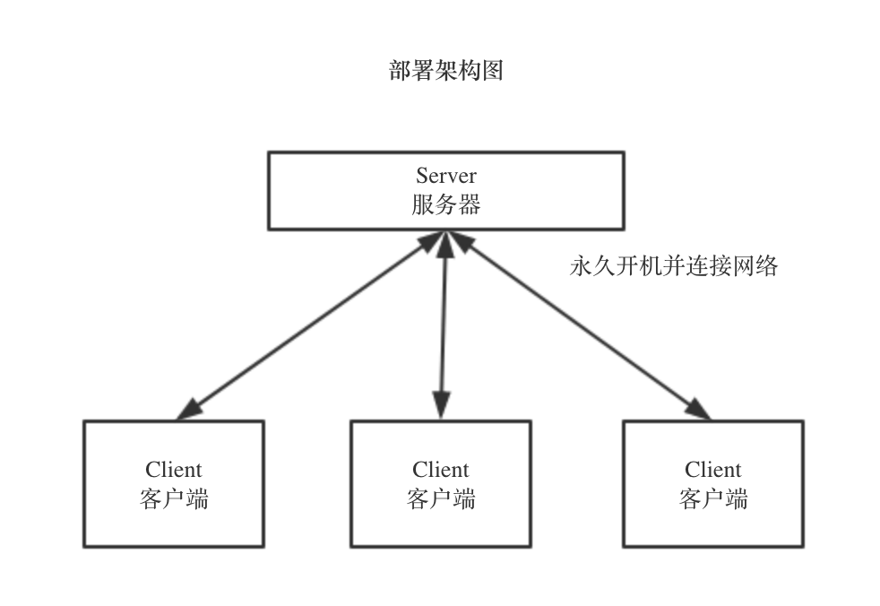
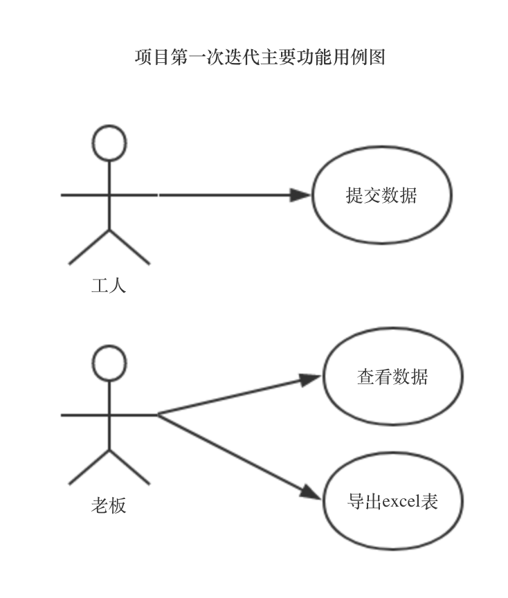
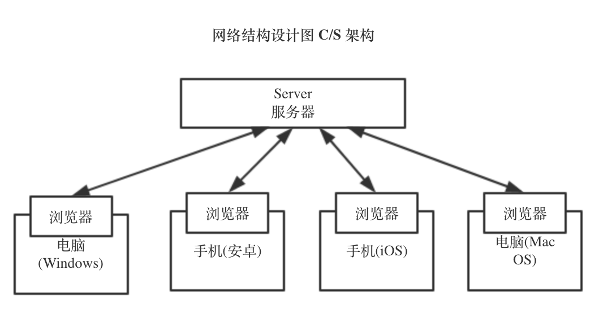

# 数字化工厂监测平台 - 项目交付说明
Designed By 陈加奇, 田昕峣

# 项目背景

员工在记录锅炉房的燃气表，温度表数据时无法实时将数值展现给管理人员，而燃气消耗量的均值和公司效益紧密相连。
相关管理人员需要实时监控到锅炉的消耗和状态，以便及时作出调整，达到利益最大化。

# 项目需求

员工可以将获取的燃气表，
温度表等数据上传，相关监管人员可实时查看数据，包括锅炉编号，时间，地点，燃气耗量，温度，水、电消耗量，
以便及时调整锅炉状态，降低通信成本，同时提高效益。

# 软件设计

## 项目架构设计理念

本项目采用近年来流行的"微服务架构"理念进行设计，该理念主要强调"弹性、可靠、快速起停"。

对于本项目而言，由于工厂数据监测需要持久化地运行软件服务，用以满足
"不论何时何地都可快速、可靠的提交数据"的需求，采用此种设计理念可谓非常适合。

此外，由于工厂内本身不具备技术支持部门或运维部门，故本项目的所有模块均采用"容器技术"
进行模块封装。容器技术由于具备"自动纠错、自动部署、自动起停、自动运维"等功能，
几乎不需要技术人员额外进行软件维护的工作，因此非常适合非 IT 领域的企业使用。
这也是本次项目使用这种架构的初衷。

## 项目架构设计

本项目采用软件架构设计中经典的"MFC"架构模型进行设计。即: 表现层、数据资源层、数据库 这三个层次结构。

由于项目中存在着数据提交、数据读取等需求，因此必须设计数据持久化等模块的设计，故必须采用数据库作为数据持久化的媒介。

(上图: 项目架构设计图)

## 项目部署设计

(上图: 项目部署设计图)

## 项目功能需求设计用例图

(上图: 项目用例图)

## 项目实际应用场景示意图

(上图: 项目实际应用场景示意图)

# 项目后续版本迭代展望

- 权限系统: 老板和员工分别登陆: 有自己的账号，对应不同的功能和权限。
- 动态视图: 利用 Js 和 Ajax 等前端技术，实现网站的动态数据刷新。
- 数据可视化模块: 利用百度等数据可视化接口，提供可视化监测，比如数据大屏和数据动态绘制图标功能，实现实时监测。
- 安全性考量: 通过使用 https 协议和用户名密码功能等，前面优化提升网站安全性。
- 公网持久化部署: 利用云服务器满足生产级别的软件运行条件和各项指标。
- 界面美化: 提供更加绚丽的用户界面，从而满足真正生产应用级别的数据平台信息系统的要求。

